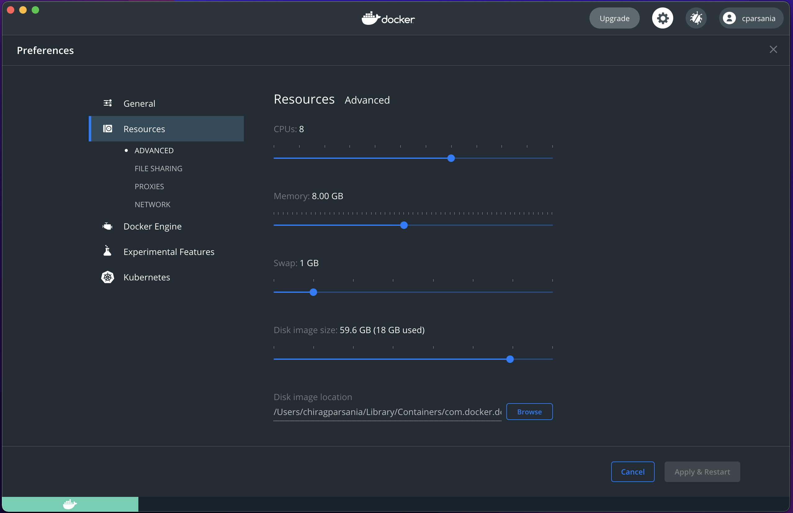

<!-- README.md is generated from README.Rmd. Please edit that file -->

```{r, include = FALSE}
knitr::opts_chunk$set(
  collapse = TRUE,
  comment = "#>",
  fig.path = "man/figures/README-",
  out.width = "100%",
  eval = FALSE
)
```

# FungiExpresZ <a href='https://raw.githubusercontent.com/cparsania/FungiExpresZ/master/inst/app/www/hex_sticker.png' target="_blank"></a>

<!-- badges: start -->

```{r, echo = FALSE, results='asis' , message=FALSE}
cat(
        ##  release version
        "",
        
        ##  development  version
        badger::badge_devel("cparsania/FungiExpresZ", "red"), 
        
        ## lifecycle
	badger::badge_lifecycle("maturing" , color = "yellow"),
        
        ## CRAN release 
	badger::badge_cran_release("FungiExpresZ", "green")
        
	
)

```

<!-- badges: end -->

## Overview

FungiExpresZ is a browser based user interface (developed in R-shiny) to analyse and visualize gene expression data. It allows users to visualize their own gene expression data as well as more than 13,000 pre processed SRA fungal gene expression data. Users can even merge their data with SRA data to perform combined analysis and visualizations. Just uploading gene expression matrix (.txt file where rows are genes and column are samples), users can generate 12 different exploratory visualizations and 6 different GO visualizations. Optionally, users can even upload multiple gene groups and sample groups to compare between them. GO analysis and GO visualizations can be performed for more than 100 different fungal species. Users can select set of genes directly from one of the scatter plot, line plot or heatmap and pass them for GO analysis and GO visualizations.

## Key features

### 1.1 More than 13,000 [NCBI-SRA](https://www.ncbi.nlm.nih.gov/sra) data from 8 different fungal species.

FungiExpresZ provides normalized gene expression values (FPKM) for more than 13,000 SRA samples. User can select one more data for visualizations. Data can be searched based on species, genotype, strain or free text which will be matched against several SRA columns.

```{r, eval=TRUE, echo=FALSE}
library(magrittr)
dd <- tibble::tribble(
                                 ~species, ~sra_samples,
           "Aspergillus nidulans FGSC A4",      151,
                "Candida albicans SC5314",      639,
               "Saccharomyces cerevisiae",    11872,
            "Aspergillus fumigatus Af293",      242,
           "Aspergillus niger CBS 513.88",      253,
               "Candida glabrata CBS 138",      126,
       "Talaromyces marneffei ATCC 18224",       26,
                   "Candida auris B8 441",       46
        ) %>% as.data.frame()

```

| species                            | sra_samples |
|:-----------------------------------|------------:|
| *Aspergillus nidulans FGSC A4*     |         151 |
| *Candida albicans SC5314*          |         639 |
| *Saccharomyces cerevisiae*         |       11872 |
| *Aspergillus fumigatus Af293*      |         242 |
| *Aspergillus niger CBS 513.88*     |         253 |
| *Candida glabrata CBS 138*         |         126 |
| *Talaromyces marneffei ATCC 18224* |          26 |
| *Candida auris B8 441*             |          46 |

> NOTE: We are continuously processing fungal SRA data. This table will be updated as we add new data.

### 1.2 Users can visualize their own data with or without integration of selected SRA data

Users can analyze and visualize their own data by uploading .txt/.csv file (columns are samples and rows are genes). Optionally, user data can be integrated with selected SRA data for combined analysis and visualization.

### 1.3 Visualize multiple gene groups and sample groups in a single plot

Optionally, user can upload sample groups (e.g. replicates, control vs treatment, wild type vs deletion etc.) and gene groups to compare between them. Group information can be used across several plots against fill and facet plot attributes.

### 1.4 12 different data exploratory visualizations

FungiExpresZ provides browser based user friendly interface, which allows users to generate **ggplot2** based 12 different publication-ready elegant visualizations. Users are allowed to adjust several common plot attributes such as plot title, axis title, font size, plot theme, legend size, legend position etc. and several other plot specific attributes. Available plot options are ...

1.  Scatter Plot  
2.  Multi-Scatter Plot  
3.  Corr Heat Box
4.  Density Plot
5.  Histogram
6.  Joy Plot
7.  Box Plot
8.  Violin Plot
9.  Bar Plot
10. PCA Plot
11. Line Plot  
12. Heatmap

### 1.5 Supports Gene Ontology (GO) enrichment and visualizations for more than 100 different fungal species

FungiExpresZ allows users to define gene-set(s) directly from plot (Scatter plot, Line plot and Heatmap) to perform gene ontology enrichment and visualizations. Available GO visualizations are ...

1.  Emap plot
2.  Cnet plot
3.  Dot plot
4.  Bar plot
5.  Heat plot
6.  Upset plot

# Getting access

There are three ways in which you can access FungiExpresZ.

## Online

FungiExpresZ has been hoisted on shinyapps.io and can be accessed through the link <https://cparsania.shinyapps.io/FungiExpresZ/>. This is one of the quickest way to access the FungiExpresZ. However, due to limited computational resources, We recommend using this approach only when the size of the data is comparatively small (\< 10 MB) and/or you are in a need of quick figure out of the data. Current setup allows approx. 30 concurrent users to access FungiExpresZ online. Additional traffic may disconnect random users' session and you may end up loosing all analysis performed. Even without access traffic idle session timeout is 30 minutes, and therefore you may loose your analysis if you have thought to continue later. For stable, robust and to have long lasting session it is recommended to use one of the following two approaches.

## Run Locally

### Use as a docker container

This approach is highly recommended for local run because as a user you do not need to worry about any dependency related issues.

#### Install docker desktop

Follow the instructions given below to install docker desktop on ...

-   [Mac](https://docs.docker.com/docker-for-mac/install/)
-   [Windows](https://docs.docker.com/docker-for-windows/install/)
-   [Linux](https://docs.docker.com/install/linux/docker-ce/ubuntu/)

#### Pull FungiExpresZ docker image to a local computer

Once the docker desktop is installed, next step is to pull the FungiExpresZ's docker image. Before you pull the image make sure your docker desktop is running. Next, to pull the image, open the terminal and enter the below command.

`docker pull cparsania/fungiexpresz:<tagName>`

Replace `<tagName>` with the version you want to download. For example, command below will download the version `1.1.0`

`docker pull cparsania/fungiexpresz:1.1.0`

Possible values for `<tagName>` can be obtained from [here](https://hub.docker.com/r/cparsania/fungiexpresz/tags). It is recommended to pull latest available tag.

#### Run container

After getting the image on local computer, it can be run as a container. The command below will open the port given as `<port_number>` on local computer and launch the application on same.

`docker run -p <port_number>:80 cparsania/fungiexpresz:<tagName>`

You can give valid TCP `<port_number>` which is not occupied by your system (e.g. 3232, 3233, 5434, ... etc.).

Successful launch will print standard `R` welcome message on terminal with the final the line [`http://0.0.0.0:80`](http://0.0.0.0:80).

#### Run on browser, Finally.!!

After launch, hitting one of these URLs [`http://localhost:<port_number`](http://localhost:%3Cport_number) or [`http://127.0.0.1:<port_number>`](http://127.0.0.1:%3Cport_number%3E) or [`http://<your_ip_address:<port_number>`](http://%3Cyour_ip_address) should launch the application on your browser.

Congrats!! 🎉🎉🎉🎉 .Your application will keep running until you stop container explicitly.

#### Memory usage for docker

Depending upon size of the data you are analyzing, you may need to assign more computational resources to docker than the default which is 2 GB of memory and 4 CPUs on a mac with 32GB memory and 8 CPUs. Default behavior can be changed from `Docker -> Preferences -> Advanced`



We recommend users to allocate maximum 4 GB of memory to docker before you run FungiExpresZ docker image.

#### How to stop container

Container will be active until it is explicitly stopped. You can stop container using below command on a new terminal window.

#### get container id

`docker ps docker stop <CONTAINER ID>`

### Install as an R package

FungiExpresZ can be installed as an R package on local computer or server. To do so basic skills of R programming is required.

#### Prerequisites

`R version (>= 3.6.1)`

Installation of FungiExpresZ as an R package is different than usual. To protect potential breakdown of various utilities of FungiExpresZ , it is recommended that FungiExpresZ uses same versions of R packages as development. Steps below will install required versions of dependency packages without affecting already installed packages in your computer.

To keep already installed R packages unaffected in local computer, FungiExpresZ will be installed in a separate directory.

#### Installation steps

1\) Create a installation directory (`e.g. FungiExpresZ_R_pkg`).

2\) Download `rlock.env` file from [here](https://raw.githubusercontent.com/cparsania/FungiExpresZ/master/renv.lock).

`rlock.env` file contains all the information required to install required versions of dependency packages.

3\) Move `rlock.env` file to installation directory created in step-1.

4\) Download appropriate appropriate package bundle. :point_right: [Download package bundle here](https://github.com/cparsania/FungiExpresZ/releases)

    | It is highly recommended to download the latest available version. 

-   Mac : FungiExpresZ\_\<version\>.tgz

-   Windows: FungiExpresZ\_\<version\>.tar.gz

5\) Move package bundle to installation directory created in step-1.

6\) Install R pacakge `renv` from terminal.

    Open terminal to type below commands

```{bash}
cd <path/to/installation/directory>

R -e "install.packages('remotes', repos = c(CRAN = 'https://cloud.r-project.org'))"
R -e "remotes::install_github('rstudio/renv@0.9.2')" # 0.9.2 denotes the renv package version. 

```

7\) Initiate project in a current directory.

```{bash}

R -e 'renv::init()'

```

8\) Install required versions of dependency packages.

```{bash}

R -e 'renv::consent(provided = TRUE)'
R -e 'renv::restore()'

```

\| To run above commands `renv.lock` file must be in the same directory.

9\) Install R package `devtools`

```{bash}

R -e 'install.packages("devtools")'

```

9\) Install FungiExpresZ.

```{bash}

R -e 'devtools::install_local("FungiExpresZ_1.1.0.tar.gz" , dependencies=FALSE,  build = FALSE)'

```

\| In above command `FungiExpresZ_1.1.0.tar.gz` is the path to bundle file downloaded in the step-4.

10\) Run FungiExpresZ through installed R package.

```{bash}

R -e 'library(shinyBS);FungiExpresZ::run_app()'

```

11\) Access through browser

Hit the URL printed on the console to browser and you are ready to go 🎉🎉🎉🎉.
