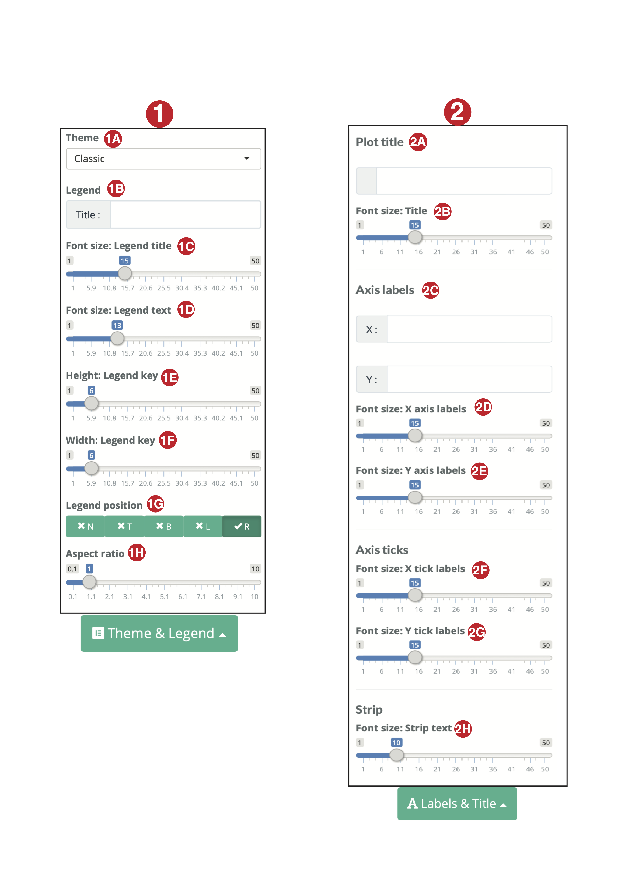
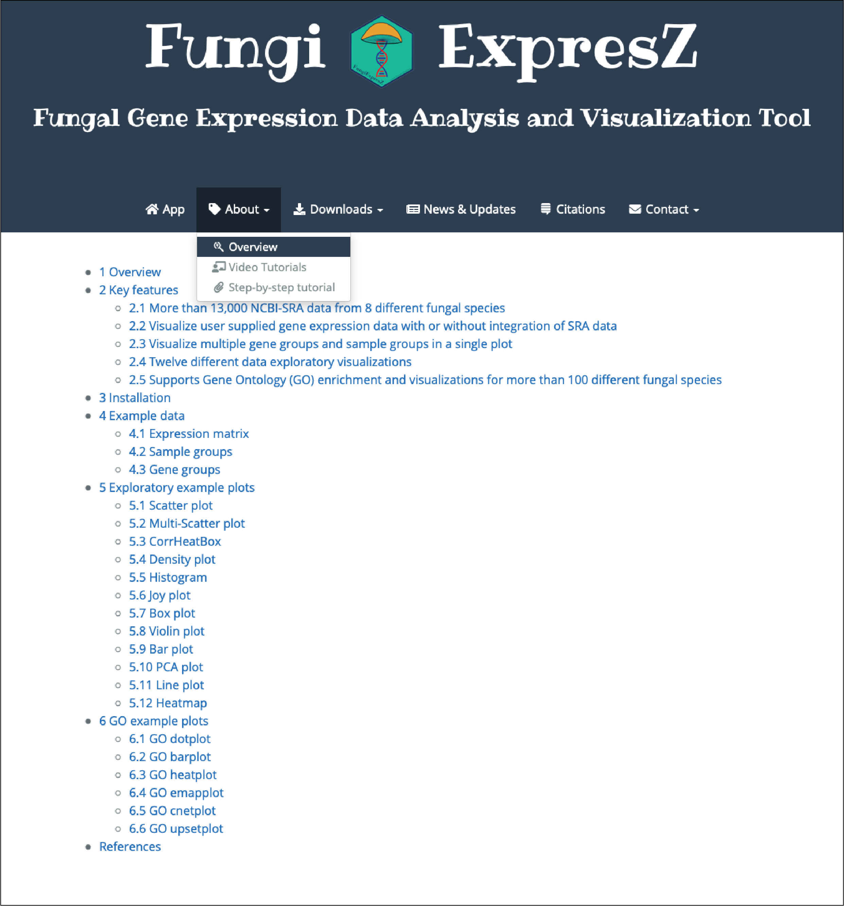

```{r, include = FALSE}
knitr::opts_chunk$set(
  collapse = TRUE,
  echo = FALSE, 
  fig.align="center", 
  fig.show="hold" , 
  comment = "#>",
  eval = FALSE
)
```

# Introduction

FungiExpresZ is a web based platform to analyze and visualize fungal gene expression data. It allows you to analyze and visualize ...

1)  NCBI SRA fungal gene expression data.
2)  User uploaded gene expression data.
3)  NCBI SRA data combined with User uploaded data (1+2).

It contains normalized gene expression values of more than 12,000 NCBI SRA data from 8 different fungal species and, gene annotations and GO data of more than 100 different fungal species. For 3 strategies mentioned above, you can generate 12 different data exploratory plots and 6 different GO plots.

#### Data exploratory plots

1)  Scatter plot
2)  Multi-scatter plot
3)  CorrHeatBox
4)  Density plot
5)  Histogram
6)  joy-plot
7)  box-plot
8)  Violin plot
9)  Bar plot
10) PCA plot
11) Line plot
12) Heatmap

#### GO plots

1)  EMAP plot
2)  CNET plot
3)  Dot plot
4)  Bar plot
5)  Heat box
6)  Upset plot

The purpose of this document is to explain key functionalities and methods implemented in FungiExpresZ.

# Getting access

There are three ways in which you can access FungiExpresZ.

## Online

FungiExpresZ has been hoisted on shinyapps.io and can be accessed through the link <https://cparsania.shinyapps.io/FungiExpresZ/>. This is one of the quickest way to access the FungiExpresZ. However, due to limited computational resources, We recommend using this approach only when the size of the data is comparatively small (\< 10 MB) and/or you are in a need of quick figure out of the data. Current setup allows approx. 30 concurrent users to access FungiExpresZ online. Additional traffic may disconnect random users' session and you may end up loosing all analysis performed. Even without access traffic idle session timeout is 30 minutes, and therefore you may loose your analysis if you have thought to continue later. For stable, robust and to have long lasting session it is recommended to use one of the following two approaches.

## Run Locally

### Use as a docker container

This approach is highly recommended for local run because as a user you do not need to worry about any dependency related issues.

#### Install docker desktop

Follow the instructions given below to install docker desktop on ...

-   [Mac](https://docs.docker.com/docker-for-mac/install/)
-   [Windows](https://docs.docker.com/docker-for-windows/install/)
-   [Linux](https://docs.docker.com/install/linux/docker-ce/ubuntu/)

#### Pull FungiExpresZ docker image to a local computer

Once the docker desktop is installed, next step is to pull the FungiExpresZ's docker image. Before you pull the image make sure your docker desktop is running. Next, to pull the image, open the terminal and enter the below command.

`docker pull cparsania/fungiexpresz:<tagName>`

Replace `<tagName>` with the version you want to download. For example, command below will download the version `1.1.0`

`docker pull cparsania/fungiexpresz:1.1.0`

Possible values for `<tagName>` can be obtained from [here](https://hub.docker.com/r/cparsania/fungiexpresz/tags). It is recommended to pull latest available tag.

#### Run container

After getting the image on local computer, it can be run as a container. The command below will open the port given as `<port_number>` on local computer and launch the application on same.

`docker run -p <port_number>:80 cparsania/fungiexpresz:<tagName>`

You can give valid TCP `<port_number>` which is not occupied by your system (e.g. 3232, 3233, 5434, ... etc.).

Successful launch will print standard `R` welcome message on terminal with the final the line [`http://0.0.0.0:80`](http://0.0.0.0:80).

#### Run on browser, Finally.!!

After launch, hitting one of these URLs [`http://localhost:<port_number`](http://localhost:%3Cport_number) or [`http://127.0.0.1:<port_number>`](http://127.0.0.1:%3Cport_number%3E) or [`http://<your_ip_address:<port_number>`](http://%3Cyour_ip_address) should launch the application on your browser.

Congrats!! 🎉🎉🎉🎉 .Your application will keep running until you stop container explicitly.

#### Memory usage for docker

Depending upon size of the data you are analyzing, you may need to assign more computational resources to docker than the default which is 2 GB of memory and 4 CPUs on a mac with 32GB memory and 8 CPUs. Default behavior can be changed from `Docker -> Preferences -> Advanced`

{width="2556"}

We recommend users to allocate maximum 4 GB of memory to docker before you run FungiExpresZ docker image.

#### How to stop container

Container will be active until it is explicitly stopped. You can stop container using below command on a new terminal window.

#### get container id

`docker ps docker stop <CONTAINER ID>`

### Install as an R package

FungiExpresZ can be installed as an R package on local computer or server. To do so basic skills of R programming is required.

#### Prerequisites

`R version (>= 3.6.1)`

Installation of FungiExpresZ as an R package is different than usual. To protect potential breakdown of various utilities of FungiExpresZ , it is recommended that FungiExpresZ uses same versions of R packages as development. Steps below will install required versions of dependency packages without affecting already installed packages in your computer.

To keep already installed R packages unaffected in local computer, FungiExpresZ will be installed in a separate directory.

#### Installation steps

1)  Create a installation directory (`e.g. FungiExpresZ_R_pkg`).

2)  Download `rlock.env` file from [here](https://raw.githubusercontent.com/cparsania/FungiExpresZ/master/renv.lock).

`rlock.env` file contains all the information required to install required versions of dependency packages.

3)  Move `rlock.env` file to installation directory created in step-1.

4)  Download appropriate appropriate package bundle. 👉 [Download package bundle here](https://github.com/cparsania/FungiExpresZ/releases)

    | It is highly recommended to download the latest available version.

-   Mac : FungiExpresZ\_\<version\>.tgz

-   Windows: FungiExpresZ\_\<version\>.tar.gz

5)  Move package bundle to installation directory created in step-1.

6)  Install R pacakge `renv` from terminal.

    Open terminal to type below commands

```{bash}
cd <path/to/installation/directory>

R -e "install.packages('remotes', repos = c(CRAN = 'https://cloud.r-project.org'))"
R -e "remotes::install_github('rstudio/renv@0.9.2')" # 0.9.2 denotes the renv package version. 

```

7)  Initiate project in a current directory.

```{bash}

R -e 'renv::init()'

```

8)  Install required versions of dependency packages.

```{bash}

R -e 'renv::consent(provided = TRUE)'
R -e 'renv::restore()'

```

| To run above commands `renv.lock` file must be in the same directory.

9)  Install R package `devtools`

```{bash}

R -e 'install.packages("devtools")'

```

9)  Install FungiExpresZ.

```{bash}

R -e 'devtools::install_local("FungiExpresZ_1.1.0.tar.gz" , dependencies=FALSE,  build = FALSE)'

```

| In above command `FungiExpresZ_1.1.0.tar.gz` is the path to bundle file downloaded in the step-4.

10) Run FungiExpresZ through installed R package.

```{bash}

R -e 'library(shinyBS);FungiExpresZ::run_app()'

```

11) Access through browser

Hit the URL printed on the console to browser and you are ready to go 🎉🎉🎉🎉.

# Home screen

Once the application loaded fully on a browser, it looks like as shown in the Fig-1.


**1). Inputs**

It allows you to either upload or select data from pre-existing SRA data. Depending upon radio button selected (**Select data** or **Upload/Use example data**) submit button toggle between **Select** and **Upload**. Click either of these result in a pop-up which have been explained in Fig-2 and Fig-3.

**2). Assign groups**

Often genomics and transcriptomics data contain sample groups i.e. replicates, strains, time points etc. and gene-groups i.e. differentially expressed genes, genes specific to pathway etc. Comparison between them could reveal similarities and contrasts between these groups, which ultimately leads to unfold meaningful biological insights. **Assign groups** feature allows you to upload user defined **Sample groups** and **gene-groups**. Additional info on file format to assign groups given in the Fig-4 and Fig-5. Once the groups uploaded, you may color, cluster or facet the expression values in different plots according to groups assigned.

**3). View active groups**

By clicking on **View active groups** one can check the current active groups (both sample and gene).

**4). Usage**

It displays the locations across the globe, where FungiExpresZ has been used at least once. Blink sign is the indication of "at this moment" access from particular location. Through the click on anywhere in the map you can get more insights on usage statistics across the globe.

**5). - 10).**

Number 5-10 are different tabs i.e. **App**, **About**, **Downloads**, **News & Updates** ,**Citations**, **Contact**. Although one can anticipate content of each tab from the name, details on each has been given later in the tutorial. Current selected tab in Fig-1 is **App**. As you can see, it contains 12 different plot panels (default open is **Scatter plot**). Each plat panel is explained later in the tutorial.

# Select/Upload data

Once you click on Select/Upload data (Fig-1 \#2) relevant pop-up will appear.

## Select SRA data

FungiExpresZ contains \> 13,000 pre-processed NCBI SRA data from 8 different fungal species. The values given are normalized gene expressed values (FPKM / RPKM etc.) Some of these data have been obtained from public resources while remaining ones are processed by us. You can select any of these data for purpose of analysis and visualizations. Once you click on Select data button the pop-up will appear as shown in Fig-2.

{width="592"}

**1) Organism**

Drop-down **Organism** allows you to select organism of your choice. Once organism selected table below will show data of selected organism only.

**2) Strain and 3) Genotype**

Drop-down **Strain** and **Genotype** allows you to filter by stain and genotype respectively for selected Organism. Both of these filters works with AND operator and therefore, while applying them together will only work if both condition satisfy. P.S. Current settings doesn't allow selection of more than one value in each filter.

**4) Reset Strain** and **5) Reset Genotype**

\#4 and \#5 are reset options for drop-down **Strain** and drop-down **Genotype** respectively.

**6) Select all rows**

Once the data filtered (By organism, strain and genotype) you need to select the row(s) from resultant table to make them available for analysis and visualization. As name suggests click on **Select all rows** will select all the rows being displayed in the table. You may also use `shift` key from the keyboard to select more than one rows simultaneously.

**7) Copy**

Click on **Copy** button copy data displayed in the table to your clipboard. You may paste them to any spreadsheet like program to better organize and understand.

**8) Download**

Using button **Download** you can even download data being displayed in the table to one of these three formats i.e. .csv, .pdf or excel.

**9) Column visibility**

Click on **Column visibility** will lists the hidden columns to the table. You may select one or more of them to make them visible in the table being displayed.

**10) Search**

Besides **Organism**, **Strain** and **Genotype** filters, you can perform free text filter from the text box given under **Search** title. Input text will be matched against all the column being displayed in the table and matching rows will be displayed as a result.

**11) Clear all**

Click on **Clear all** will deselect rows if selected any.

**12) Submit**

Once the rows selected hitting button **Submit** will make selected data available for analysis. For selected data, SRA id will be displayed as sample identity in each plot panel.

## Upload user data

Often transcriptomics data found in a tabular like format where columns are samples i.e. replicates, time-points, multiple strain types etc. and rows are genes. Each cell in a table contains normalized gene expression values. You can either upload such a tabular format data in .txt file format or paste in a text box to FungiExpresZ for the purpose of analysis and visualization. Once you click on the button **Upload** (Fig-1 \#2), pop-up showed in the Fig-3 will appear.

{width="542"}

**1) Upload example data**

Upon selection of this check-box example data will be activated.

**2) Upload data**

This section allows you to upload your own data. As mentioned above you may either choose uploading tabular format data in .txt file or paste data in a given text box. In both cases column names and row names are necessary requirements. Later, while analyzing data column names will appear as a sample identity in each plot panel, while row names will be used in background to fetch organism's annotations (gene start, gene end, gene strand,gene description, GO terms etc.).

**3) Select column separator**

Selection of correct column separator for the uploaded data is required to upload data successfully. Default is **tab**. You may also select **comma** or **semicolon**.

**4) Select species**

Selection of a species is optional. However, correct species selection is required to perform gene annotations and GO analysis. Once the species selected is done, in background FungiExpresZ matches row names of uploaded data to the database id of selected species. For the selected species, you can cross check your id with the database id from the example database id given below the species selection drop-down menu.

**5) Log transformation**

Due to wide range of RPKM / FPKM / TPM values, often, they need to be log transformed before visualizing the data. Once the data uploaded, FungiExpresZ allows you to log transform (log2 or log10) uploaded data. To avoid `NAs` from the log transformation of 0s, FungiExpresZ adds constant 1 to all the uploaded values.

**6) Join data**

FungiExpresZ allows you to perform combined analysis of uploaded data with pre-existing NCBI-SRA data. To use this functionality, you first need to select the pre-existing NCBI-SRA data of you interest from the FungiExpresZ. To know more about how to select SRA data refer the section **Select SRA data** (Fig-2). Next step is to upload your data, which you want to join with selected NCBI-SRA data. Once both these steps done, you can select **Join data** option to merge both of these data in background. For successful execution of join data operation row names of uploaded data must match to the database id of a selected species.

**7) Submit**

Click on **Submit** will lock all inputs made above and data will be available for the analysis and visualizations.

# Assign groups {#assign-groups}

Often genomics and transcriptomics data contain sample groups i.e. replicates, strains, time points etc. and gene-groups i.e. differentially expressed genes, genes specific to pathway etc. Comparison between them could reveal similarities and contrasts between these groups, which ultimately leads to unfold meaningful biological insights. Assign groups feature allows you to upload user defined Sample groups and gene-groups. In here, we discussed about technicalities of group assignments.

{width="535"}

## Sample groups

Click on the button **Sample groups** will open up the pop-up showed in the Fig-4. There are three different ways by which you can assign the sample groups for your data.

**1) Manual**

Using this option you can assign maximum of two sample groups. Under the section **Group name** you can input unique name to each group; default group names are **Group_1** and **Group_2**. Under the drop-down of **Group members** you can select the samples from active data and assign them to one of the two groups. Each sample must be assigned to one of the two groups.

**2) Upload**

Second option to assign the sample groups is via user data upload. You can either upload groups via .txt file or paste data in the given text box. Both of these ways require identical data format i.e. a matrix of two columns, where first column contains group name and second column contains group members. A tab, a semicolon or a comma can be used as column deliminator. First row of the matrix will be considered as column names, which you can give of your choice. Each group member (column 2) must be assigned to the single group. Group members (column 2), which are used as sample names in the uploaded data will only be used to assign the groups and rest will be discarded.

**3) Group by BioProject(NCBI)**

While analyzing the samples from NCBI-SRA data alone or along with user uploaded data, it is important to know which are the SRA samples from same study and which are from different. In background, FungiExpresZ clusters NCBI-SRA samples by NCBI-BioProjectID. You can activate sample groups by NCBI-BioProjectID by click on button **Submit** under this panel.

**6) Submit**

Click on the submit button will activate the assigned groups. It is important to note that every time you change the gene expression data, group data will be lost although the groups are same. To reactivate the same groups you need to click **Submit** again or upload groups in case of different groups.

## Gene groups

Click on the button **gene-groups** will open up the pop-up showed in the Fig-5. You can either upload file or paste data in a given text box to assign the gene-group.

{width="567"}

**1) Upload**

To assign the gene-groups, you can either upload groups via .txt file or paste data in the given text box. Both of these ways require identical data format i.e. a matrix of two columns, where first column contains group name and second column contains group members. First row of the matrix will be considered as column names, which you can give of your choice. Each group member (column 2) must be assigned to the single group. Group members (column 2), which are used as gene names in the uploaded data will only be used to assign the groups and rest will be discarded.

**2) Column separator**

While uploading the groups you can use a tab or a semicolon or a comma as a column deliminator.

**3) Example data snap**

The snap shot showing the format for gene-groups.

# Plot panels

FungiExpresZ allows you to generate 12 data exploratory plots, which are **1)** Scatter plot, **2)** Multi-scatter plot, **3)** CorrHeatBox, **4)** Density plot, **5)** Histogram, **6)** joy-plot, **7)** box-plot, **8)** Violin plot, **9)** Bar plot, **10)** PCA plot, **11)** Line plot and **12)** Heatmap. Each of these have independent panel containing necessary inputs, plot output and other plot settings. Below sections have discussed each plot panel and their options in detail.

## Plot input panels

### Scatter plot

Fig-6 shows the scatter plot input panel.


**1) Select sample (X-axis)**

Select sample which is to be shown on the axis-X in a scatter plot.

**2) Select sample (Y-axis)**

Select sample which is to be shown on the axis-Y in a scatter plot.

**3) Select gene-groups**

By default, all the observations / genes will be displayed in a scatter plot. Optionally, selecting gene-group(s) allow you to show group specific observations / genes in a scatter plot.

**4) Plot**

Hitting a button **'Plot'** will open up a plot panel containing resultant scatter plot and other plot settings.

### Multi-scatter plot, CorrHeatBox, Density plot, Histogram, joy-plot, box-plot, Violin plot and PCA plot

Multi-scatter plot, CorrHeatBox, Density plot, Histogram, joy-plot, box-plot, Violin plot and PCA plot require same inputs, which are shown in Fig-7.


**1) Select sample(s)**

You can select one or more samples from the drop down **'Select samples'**. All selected samples will be displayed in the resultant plot.

**2) Select gene-group(s)**

By default, all the observations / genes will be displayed in the resultant plots. Optionally, selecting one or more gene-group(s) allow you to show group specific observations / genes set in the output plot.

**3) Plot**

Hitting a button **'Plot'** will open up a plot panel containing resultant plot and other plot settings.

### Bar plot inputs

The purpose of the bar plot given here is to check the expression of individual gene(s) in multiple samples or sample groups. Bar plot input panel is shown in the Fig-8.


**1) Select sample(s)**

You can select one or more samples from the drop down **'Select samples'**. All selected samples will be displayed in the resultant plot.

**2) Select gene(s)**

Instead of the gene-groups like in other plots, in bar plot you can select one or more genes which will be displayed in output bar plot.

**3) Plot**

Hitting a button **'Plot'** will open up a plot panel containing resultant bar plot and other plot settings.

### Line plot inputs

Line plot is a powerful way to show the trends of observations / genes across multiple samples. For example, one of the ways to use this plot is to show expression of genes across several time point samples. FungiExpresZ also allows to cluster observations / genes both unsupervised and supervised way, and simultaneous visualization of clustered data. Additionally, you can even display average line (mean or median) instead of individual line of each gene / observation in each cluster. The input panel of the line plot has been shown in the Fig-9.

{width="683"}

**1) Select sample(s)**

You can select one or more samples from the drop down **'Select samples'**. All selected samples will be displayed in the resultant plot.

**2) Select gene-group(s)**

By default, all the observations / genes will be displayed in the resultant plot. Optionally, selecting one or more gene-group(s) allow you to show group specific observations / genes set in the output plot.

**3) Genes to plot**

This option provide additional filter on top of genes selected under option \#2. You can choose between display **'\# top variable genes (By standard deviation)'** or display **'All genes'**.

-   **\# top variable genes (By standard deviation)**

Selecting this option will plot number of genes specified in the given numeric input. It calculates standard deviation of each observation / gene across selected samples in \#1 and ranks them from high to low by standard deviation to select and plot number of specified genes / observations.

-   **All genes**

Selecting this option will plot all the genes filtered by \#2.

**4) \# top variable genes to show**

Numeric input is required if the option **'\# top variable genes (By standard deviation)'** is selected. Input number will be used to select the top variable genes ranked by standard deviation as described in the previous section.

**5) Gene cluster**

You can cluster observation / genes either by un-supervised (**'K-means'**) or supervised (**'gene-groups'**) way . Simultaneously each cluster can be visualized in the resultant line plot.

-   **K-means**

K-means clustering is one of the popular methods to perform the un-supervised clustering of gene expression data. While doing un-supervised clustering number of clusters are not known prior to the clustering. Before you do the clustering, number of clusters need to be specified in which you want to group the data. To perform the k-means clustering, FungiExpresZ uses the function `stats::kmeans()` with all default parameters.

-   **gene-groups**

You can also perform supervised clustering of the genes/observations if prior cluster information is provided as gene-groups. As mentioned earlier (In the section **Assign groups**), you can assign gene-groups to your data. The same gene-groups can be used here to cluster the genes/observations and simultaneously visualized in the line plot.

**6) \# of clusters (K-means)**

For K-means clustering, number of clusters in which data needs to be grouped.

**7) Cluster by**

You can choose either Z-score or Raw values to cluster the genes/observations.

-   **Raw value**

When selecting the option **'Raw value'**, user uploaded values will be used to cluster the genes / observations.

-   **Z-score**

When selecting the option **'Z-score'**, FungiExpresZ will use the Z-score calculated from raw values for each observation/gene across selected samples. To calculate the Z-score FungiExpresZ uses the R function `base::scale()` with all default parameters.

**8) Display value**

Likewise parameter **'Cluster by'**, you can use parameter **'Display value'** value to choose which value to be displayed in the plot regardless of value selected in **'Cluster by'**.

-   **Raw value**

When selecting the option **'Raw value'**, user uploaded values will be displayed in the output line plot.

-   **Z-score**

When selecting the option **'Z-score'**, Z-score calcualted for each gene across selected samples will be displayed in the output line plot.

**9) Display lines for**

Under this parameter, you can choose whether to display individual line for each gene in each cluster or single line showing average of all genes for each cluster in output line plot.

-   **Individual gene**

Selecting this option will display individual line for each gene in each cluster.

-   **Average of gene**

Selecting this option will display average line (mean or median) for all genes in each cluster.

**10) Plot**

Hitting a button **'Plot'** will open up a plot panel containing resultant line plot and other plot settings.

### Heatmap inputs

Heatmap is a very popular way to represent various genomics or transcriptomics data. Very often, heatmap is used to reveal hidden patterns from gene expression data. FungiExpresZ implements one of the very powerful R packages i.e. ComplexHeatmap to create the heatmap. To get most out of the data, there are several Row, Column and Legend specific options provided, which give users lots of flexibility while creating a heatmap. Input panel for the heatmap has been shown in the Fig-10.

{width="600"}

1.  [**Select sample(s)**]{.ul}

You can select one or more samples from the drop down **'Select sample(s)'**. All selected samples will be displayed in the output heatmap plot.

2.  [**Select gene-groups(s)**]{.ul}

By default, all the observations / genes will be used to generate output heatmap plot. Optionally, selecting one or more gene-group(s) allow you to show group specific observations / genes set in the output plot.

3.  [**Number of genes to plot**]{.ul}

By default, FungiEpxresZ plots heatmap of top 500 most variable genes from all uploaded / selected gene-group(s). However, you can change the number of genes to be shown under the input '**\# of top variable genes to show'**. The genes will be selected from the remaining genes once the '**Select genes group(s)'** (\#2) filter is applied. To select the top variable genes, FungiEpxresZ uses the standard deviation that is calculated for each gene across selected samples. Higher the standard deviation more the variability and vice versa. You can also choose the option '**All genes'** to display all the genes remained after '**Select gene-group(s)'** filter if applied.

4.  [**\# of top variable genes to show**]{.ul}

Input a number to display top variable genes in the heatmap (Default 500). To select the top variable genes, FungiEpxresZ uses the standard deviation that is calculated for each gene across selected samples.

5.  [**Cluster by**]{.ul}

Select a value between **'Z-score'** or '**Raw values**' to cluster the genes/observations. If '**Z-score'** is selected, for each gene/observation '**Z-score'** values will be converted to '**Z-score**' prior to cluster genes. To calculate the Z-score FungiExpresZ uses the R function `base::scale()` with all default parameters. While '**Raw value**' uses user uploaded or normalized gene expression values (if samples are selected from FungiExpresZ) to cluster the genes/observations.

6.  [**Display value**]{.ul}

Likewise parameter **'Cluster by'**, you can use parameter **'Display value'** to choose which value to be displayed in the heatmap plot regardless of value selected in **'Cluster by'**.

7.  [**Row options**]{.ul}

-   **7A. Row names:** If '**TRUE**' row names will be displayed in the heatmap.
-   **7B. Row names font size:** Adjust size of row names in the heatmap.
-   **7C. Row cluster:** Cluster heatmap rows either by unsupervised K-means clustering or user uploaded gene-group(s).
-   **7D. \# row clusters:** Select number of row clusters to display if clustering method is K-means.
-   **7E. Row cluster label prefix:** Input string, default '**Clust\_**', will be used as a prefix to label each row cluster.
-   **7F. Row cluster (within the cluster):** If '**TRUE**', additional hierarchical clustering will be performed within each row cluster.
-   **7G. Row dendrogram (within the cluster):** If '**TRUE**', individual row dendrogram for each cluster will be displayed.
-   **7H. Row cluster border (within the cluster):** If '**TRUE**', each row cluster will be bordered.
-   **7I. Add standard deviation heatmap (within the cluster):** If '**TRUE**', an additional single column standard deviation heatmap will be displayed parallel to data heatmap.
-   **7J. Sort by standard deviation:** If '**TRUE**', data within the heatmap will be ordered by standard deviation of each gene.

8.  [**Column options**]{.ul}

-   **8A. Column names:** If '**TRUE**' column names will be displayed in the heatmap.

-   **8B. Column names font size:** Adjust size of column names in the heatmap.

-   **8C. Column cluster:** Cluster heatmap columns either by unsupervised K-means clustering or user uploaded sample groups(s). If data are selected from FungiExpresZ, samples will be clustered by NCBI bio-project ID.

-   **8D. \# column clusters(k-means):** Select number of column clusters to display if clustering method is K-means.

-   **8E. Column cluster label prefix:** Input string, default '**Clust\_**', will be used as a prefix to label each column cluster.

-   **8F. Column cluster (within the cluster):** If '**TRUE**', additional hierarchical clustering will be performed within each column cluster.

-   **8G. Column dendrogram:** If '**TRUE**', individual column dendrogram for each cluster will be displayed.

-   **8H. Column annotation:** Add column annotations - color for '**sample groups**' or '**box-plot**' for each column, on top of heatmap.

-   **8I. Column annotation height:** Adjust height for column annotations.

9.  [**Legend options**]{.ul}

-   **9A. Legend name:** A string, default '**Value**', to label heatmap legend.

-   **9B. Legend position:** Adjust position of the legend (T - top, B - bottom, L - left, R - right) with respect to heatmap.

-   **9C. Legend direction:** Adjust direction of the legend (H - horizontal, V - vertical) with respect to heatmap.

-   **9D. Heatmap colors:** Select heatmap colors for low, middle and high data values.

-   **9E. Heatmap scale:** Fix maximum and minimum values

10. [**Plot**]{.ul}

HItting this button will generate a heatmap plot in a separate heatmap panel.

# Plot settings

## Common plot settings



1.  [**Theme and Legend**]{.ul}

-   **1A. Theme:** A drop-down to select a theme (Grey, Black and White (BW), Line Draw, Minimal, Light, Dark, Classic and Test) for the plot.

-   **1B. Legend Title:** A text-box to set title for the legend.

-   **1C. Font Size: Legend title:** A slide-bar to set font size for the legend title.

-   **1D. Font Size: Legend text:** A slide-bar to set font size for the legend text.

-   **1E. Height: Legend key:** A slide-bar to set height for the legend key.

-   **1F. Width: Legend key:** A slide-bar to set width for the legend key.

-   **1G. Legend position:** Set of choices to set legend position (**N** - None, **T** - Top, **B** - Bottom, **L** - Left, **R** - Right).

-   **1H. Aspect ratio:** A slide-bar to set image aspect ratio.

2.  [**Labels & Title**]{.ul}

-   **2A. Plot title:** A text -box to set title for the plot.

-   **2B. Font size: Title:** A slide-bar to adjust font size of the plot title.

-   **2C. Axis labels:** A text-box to set labels for the X and Y axis.

-   **2D. Font size: X axis labels:** A slide-bar to adjust font size of the X-axis labels.

-   **2E. Font size: Y axis labels:** A slide-bar to adjust font size of the Y-axis labels.

-   **2F. Font size: X tick labels:** A slide-bar to adjust font size of the X-axis tick labels.

-   **2G.Font size Y tick labels:** A slide-bar to adjust font size of the Y-axis tick labels.

-   **2H. Font size Strip text:** A slide-bar to adjust font size of the strip text. Only useful when plots are faceted either by samples, sample groups or gene-groups.

## Plot specific settings

Besides common plot settings, each plot has plot specific settings provided under the tab "Advanced options".

### Scatter plot

{width="313"}

1.  **Axis limits**: Click on \`set\` pops-up a text-box which allows users to set minimum and maximum values for X and Y axis.

2.  **Trend line:** Buttons under this option allow turn on or off trend line.

    -   **Off:** Turn off trend line.

    -   **From data:** Auto generate trend line from the slope and intercept

    -   **Manual:** A trend line will be generated from the user input intercept and slope.

3.  **Color by:** Set color for the dots in the scatter plot.

    -   **Density:** Dots will be colored based according to data density.

    -   **Manual:** This option pops-up color pallets to select colors manually.

    -   **gene-groups:** Color dots by gene-groups. Color by this option require users to upload gene-groups. See [Assign groups]. Selecting this option without any groups color dots uniformly.

4.  **Transparency:** A slide-bar to adjust transparency of the dots.

5.  **Point size:** A slide-bar to adjust size of the dots.

### Multi-scatter plot

{width="351"}

1.  **Corr text color:** Select a color from the palettes or type-in color hex code (e.g. \#FF0000) or name (e.g. red) for the correlation values displayed in the plot.

2.  **Font size: Corr text:** A slide-bar to adjust the size of the correlation values displayed in the plot.

### CorrHeatBox

{width="304"}

1.  **Number of colors:** A slide-bar to select number of colors the plot.

2.  **Cluster variables:** Decides whether to cluster samples or not.

    -   **TRUE:** Plot samples by hierarchical clustering performed on correlation values.

    -   **FALSE:** Plot samples in default order (No clustering).

```{=html}
<!-- -->
```
1.  **Method:** Display correlation values either by square or circle.

2.  **Type:** Display plot as **Full,** only **Upper half** or **Lower half**.

3.  **Scale:** Adjust scale to map values to colors.

    -   **Auto:** Colors will be mapped to Maximum and Minimum values selected from the

    -   **Manual:** Colors will be mapped to user given Maximum and Minimum values.

4.  **Show corr value:** Decide whether to show correlation values in the plot.

5.  **Font size: Corr text:** A slide-bar to adjust font size of the correlation values.

6.  **Corr text color:** Select a color form the palette for the corr values.

### Density plot

{width="366"}

1.  **Fill by:** A variable choice to fill colors in the density curve.

    -   **Manual:** Select colors manually form the color palette.

    -   **Samples:** Assign unique color to density curve of the each sample.

    -   **Sample group:** Assign unique color to density curves according to sample group(s). It is recommended that sample groups are uploaded. See [Sample groups].

    -   **Gene group:** Assign unique color to density curves according to gene-group(s). It is recommended that gene-groups are uploaded. See [Gene groups].

2.  **Separate by:** A variable choice to separate (or facet) plots.

    -   **None:** No faceting.All density curves will be included within a single plot.

    -   **Samples:** For each sample a separate density plot will be plotted.

    -   **Sample group:** For each sample group a separate density plot will be plotted. It is recommended that sample groups are uploaded. See [Sample groups].

    -   **Gene group:** For each gene group a separate density plot will be plotted. It is recommended that gene groups are uploaded. See [Gene groups].

3.  **Transparency:** A slide-bar to adjust transparency of the plot.

### Histogram

{width="368"}

1.  **Fill by:** A variable choice to fill colors in the density curve.

    -   **Manual:** Select colors manually form the color palette.

    -   **Samples:** Assign unique color to density curve of the each sample.

    -   **Sample group:** Assign unique color to density curves according to sample group(s). It is recommended that sample groups are uploaded. See [Sample groups].

    -   **Gene group:** Assign unique color to density curves according to gene group(s). It is recommended that gene groups are uploaded. See [Gene groups].

2.  **Separate by:** A variable choice to separate (or facet) plots.

    -   **None:** No faceting.All density curves will be included within a single plot.

    -   **Samples:** For each sample a separate density plot will be plotted.

    -   **Sample group:** For each sample group a separate density plot will be plotted. It is recommended that sample groups are uploaded. See [Sample groups].

    -   **Gene group:** For each gene group a separate density plot will be plotted. It is recommended that gene groups are uploaded. See [Gene groups].

3.  **Bar position:** Adjust position of the bars in the histogram.

    -   **Dodge:** Bars will be positioned next to each other.

    -   **Stack:** Bars will be stacked on top of each other. Y-Scale will be adjusted to sum of stacked bars.

    -   **Identity**: Same as stack but Y-scale will be adjusted to each bar height.

4.  **Number of bins:** A numeric-input to adjust number of bins/bars to show in the histogram.

5.  **Transparency:** A slide-bar to adjust transparency of the plot.

### Joy-plot

{width="395"}

1.  **Y-axis:** A variable choice to show values on Y-axis.

    -   **Samples:** Plot samples on Y-axis.

    -   **Sample-groups:** Plot sample groups on Y-axis. It is recommended that sample-groups are uploaded. See [Sample groups].

    -   **Gene-groups:** Plot gene-groups on Y-axis. It is recommended that gene-groups are uploaded. See [Gene groups].

2.  **Fill by:** A variable choice to fill colors in the joy-plot.

    -   **Value:** Within each observation, fill colors by data values.

    -   **Probability:** Within each observation, fill colors by probabilities.

    -   **Quantile:** Within each observation, group data by quantile and assign unique color to each quantile.

    -   **Alternative:** Assign different colors to alternative observation.

    -   **Samples:** Assign unique color to each sample.

    -   **Sample group:** Assign unique color to sample group(s). It is recommended that sample groups are uploaded. See [Sample groups].

    -   **Gene group:** Assign unique color to gene group(s). It is recommended that gene groups are uploaded. See [Gene groups].

3.  **Fill Choices:** Choices for Pre-defined color palette.

4.  **Fill reverse:** Whether toreverse color scale.

5.  **Color ridges:** Select a color from palette for ridges.

6.  **Separate by:** A variable choice to separate (or facet) plots.

    -   **None:** No faceting.All observations will be included within a single plot.

    -   **Samples:** For each sample a separate joy-plot will be generated.

    -   **Sample group:** For each sample group a separate joy-plot will be plotted. It is recommended that sample groups are uploaded. See [Sample groups].

    -   **Gene group:** For each gene group a separate joy-plot will be plotted. It is recommended that gene groups are uploaded. See [Gene groups].

### Box-plot

{width="344"}

1.  **X-axis:** A variable choice to show values on X-axis.

    -   **Samples:** Plot samples on X-axis.

    -   **Sample groups:** Plot sample-groups on X-axis. It is recommended that sample-groups are uploaded. See [Sample groups].

    -   **Gene groups:** Plot gene-groups on X-axis. It is recommended that gene-groups are uploaded. See [Gene groups].

2.  **Fill by:** A variable choice to fill colors in the box-plot.

    -   **Manual:** Select colors manually form the color palette. Selected color will be assigned to each observation.

    ```{=html}
    <!-- -->
    ```
    -   **Samples:** Assign unique color to each sample.

    -   **Sample group:** Assign unique color to sample-groups. It is recommended that sample-groups are uploaded. See [Sample groups].

    -   **Gene-group:** Assign unique color to gene groups. It is recommended that gene-groups are uploaded. See [Gene groups].

3.  **Separate by:** A variable choice to separate (or facet) plots.

    -   **None:** No faceting.All observations will be included within a single box-plot.

    -   **Samples:** For each sample a separate box-plot will be generated.

    -   **Sample-group:** For each sample-group a separate box-plot will be plotted. It is recommended that sample-groups are uploaded. See [Sample groups].

    -   **Gene-group:** For each gene-group a separate box-plot will be plotted. It is recommended that gene-groups are uploaded. See [Gene groups].

4.  **P-value:** Whether to show p-values between observation. User can choice between `t.test` or `wilcox.test` to calculate the pair-wise p-values.

5.  **Dots:** Whether to overlay dots on top of box.

6.  **Box transparency**: A slide-bar to adjust transparency of the each box.

### Violin-plot

{width="346"}

1.  **X-axis:** A variable choice to show values on X-axis.

    -   **Samples:** Plot samples on X-axis.

    -   **Sample groups:** Plot sample-groups on X-axis. It is recommended that sample-groups are uploaded. See [Sample groups].

    -   **Gene groups:** Plot gene-groups on X-axis. It is recommended that gene-groups are uploaded. See [Gene groups].

2.  **Fill by:** A variable choice to fill colors in the violin-plot.

    -   **Manual:** Select colors manually form the color palette. Selected color will be assigned to each observation.

    ```{=html}
    <!-- -->
    ```
    -   **Samples:** Assign unique color to each sample.

    -   **Sample group:** Assign unique color to sample-groups. It is recommended that sample-groups are uploaded. See [Sample groups].

    -   **Gene group:** Assign unique color to gene-groups. It is recommended that gene-groups are uploaded. See [Gene groups].

3.  **Separate by:** A variable choice to separate (or facet) plots.

    -   **None:** No faceting.All observations will be included within a single violin-plot.

    -   **Samples:** For each sample a separate violin-plot will be generated.

    -   **Sample-group:** For each sample-group a separate violin-plot will be plotted. It is recommended that sample-groups are uploaded. See [Sample groups].

    -   **Gene-group:** For each gene-group a separate box-plot will be plotted. It is recommended that gene-groups are uploaded. See [Gene groups].

4.  **P-value:** Whether to show p-values between observation. User can choice between `t.test` or `wilcox.test` to calculate the pair-wise p-values.

5.  **Show quantile:** For selected quantile values horizontal lines will be plotted within each violin.

6.  **Transparency**: A slide-bar to adjust transparency of the each violin.

### Bar-plot

{width="368"}

1.  **X-axis:** A choice of variable to show in X-axis.

    -   **Genes:** genes will be plotted on X-axis.

    -   **Samples:** Samples will be plotted X-axis.

2.  **Fill by:** A choice of variable to fill colors in bars.

    -   **Manual:** Select color manually form the color palette. Selected color will be assigned to each bar.

    ```{=html}
    <!-- -->
    ```
    -   **Genes:** Assign unique color to each gene.

    -   **Samples:** Assign unique color to each sample.

    -   **Sample-groups:** Assign unique colors to each sample-group. It is recommended that sample-groups are uploaded. See [Sample groups].

3.  **Select:** Choose colors from palette when "Fill by" selected to "Manual".

4.  **Separate by:** A variable choice to separate (or facet) plots.

    -   **None:** No faceting.All observations will be included within a single bar-plot.

    -   **Genes:** For each gene a separate bar-plot will be generated.

    -   **Samples:** For each sample a separate bar-plot will be generated.

    -   **Sample-group:** For each sample-group a separate bar-plot will be generated. It is recommended that sample-groups are uploaded. See [Sample groups].

5.  **Scale:** Adjust scale for multiple plots. Useful when plots are separated by one of the above variables.

    -   **Fix:** Both X and Y-axis scales will be identical across all faceted bar-plots.

    -   **Free:** Each bar-plot will be scaled individually according to values in X and Y-axis.

    -   **Free X:** Only X-axis in each bar-plot will be scaled individually. Scale in Y-axis will be identical across all faceted bar-plots.

    -   **Free Y:** Only Y-axis in each bar-plot will be scaled individually. Scale in X-axis will be identical across all faceted bar-plots

6.  **Transparency:** A slide-bar to adjust transparency of the each violin.

### PCA-plot

{width="378"}

1.  **Select PCs:** Select any two principle components to plot them on the X and Y-axis.

2.  **Display sample names:** Whether to show sample/variable names in the PCA plot.

3.  **Dot size:** A slide-bar to adjust size of the dots displayed corresponding to each sample/variable in the PCA plot.

4.  **Color by:** Choice of the variable to color dots displayed in the PCA plot.

    -   **Identical:** Color all samples identical.

    -   **Sample-groups:** Color samples by sample-groups. For each sample-group a separate bar-plot will be generated. It is recommended that sample-groups are uploaded. See [Sample groups].

    -   **K-means:** Color samples by K-means clusters.

5.  **Select color:** Select a color from a palette if a choice for `color by` is `Identical`

### Line-plot

{width="322"}

1.  **Color:** Choice of a variable to color lines in the line-plot.

    -   **Gene groups:** Color lines by gene-groups. It is recommended that gene-groups are uploaded. See [Gene groups].

    -   **Identical:** Color all lines identical. A color choice can be made from the color palette.

2.  **Separate by:** Choice of a variable to separate line plots.

    -   **None:** No separation/faceting. All lines will be plotted in a single plot.

    -   **Gene groups:** Separate/facet line plots by gene-groups. It is recommended that gene-groups are uploaded. See [Gene groups].

3.  **Scale:** Adjust scale for multiple plots. Useful when plots are separated by gene-groups.

    -   **Fix:** Both X and Y-axis scales will be identical across all faceted line-plots.

    -   **Free:** Each line-plot will be scaled individually according to values in X and Y-axis.

    -   **Free X:** Only X-axis in each line-plot will be scaled individually. Scale in Y-axis will be identical across all faceted line-plots.

    -   **Free Y:** Only Y-axis in each line-plot will be scaled individually. Scale in X-axis will be identical across all faceted line-plots.

4.  **Line shape:** A slide-bar to adjust line shapes.

5.  **Transparency:** A slide-bar to adjust transparency of the each line in the line-plot.

6.  **Number of columns:** A numeric input to adjust the plot arrangement in columns. Useful when line-plots are separated/faceted by gene-groups.

7.  **Point size:** A slide-bar to adjust size of the points in the line-plot.

8.  **Line size:** A slide-bar to adjust size (width) of the each line in the line-plot.

### Heatmap

Heatmap dimensions are adjusted based on screen resolution. Users can still adjust height of each row and width of each column displayed in the heatmap.

{width="386"}

1.  **Row height:** A slide-bar to adjust the height of the each row in the heatmap.
2.  **Column width:** A slide-bar to adjust the width of the each column in the heatmap.

# GO analysis and visualizations

Users can select genes either from scatter-plot, line-plot or heatmap to perform GO analysis and visualizations. From scatter-plot genes can be selected by mouse drag while in line-plot and heatmap gene cluster can be selected. Besides genes, there are few other inputs user can change for GO analysis.


1.  **Ontology:** Select ontology type - Biological Process, Cellular Component, or Molecular Function - for enrichment analysis.

2.  **Gene cluster:** Select a gene cluster for which GO enrichment analysis to be performed.

3.  **View type:** Select a type of plot to visualize enriched GO terms. Choices are...

    -   **Table**

    -   **Dot-plot**

    -   **Bar-plot**

    -   **Emap-plot**

    -   **Cnet-plot**

    -   **Upset-plot**

    -   **Heatplot**

4.  **Background Genes to GO mapping:** It allows user to select type of background data (Genes to GO mapping) to use for GO enrichment analysis.

    -   **Parent + Offsprings**: For a given GO term (e.g. GO-term-A), all the genes from term-A and term-A's offspring GO terms will be considered as a part of term-A (recommended).

    -   **Parent**: For a given GO term-A, all the genes from term-A will be considered as a part of term A.

5.  **\# of minimum genes in a GO term:** User can restrict the GO enrichment output. Only those GO terms will be displayed, which has minimum number of genes more than cutoff value.

6.  **\# of maximum genes in a GO term:** User can restrict the GO enrichment output. Only those GO terms will be displayed, which has maximum number of genes less than cutoff value.

7.  ***p-*****adjust:** Choice of methods to calculate adjusted *p-*value.

# GO plots specific settings

### Dot-plot and Bar-plot

{width="331"}

1.  **X-axis:** Choice of a variable (Count or Gene Ratio) to show on X-axis.
2.  **Color by:** Choice of a variable (*P-*value, *P-*adjust or *Q-*value) to color observations.
3.  **Show terms:** Numeric input to show number of GO terms in the plot. \

### EMAP plot

EMAP-plot is a network like plot to visualize GO enrichment results. Each node in the plot denotes to a GO term while connecting edge denotes number of genes overlapped between two terms.

{width="334"}

1.  **Font size: Node label:** A slide-bar to adjust font size of the labels to each node.
2.  **Color by:** Choice of a variable to color GO-terms.
3.  **Layout:** Select plot layout.
4.  **Show terms:** A numeric input to show number of GO-terms.

### CNET plot

Like EMAP-plot CNET is also a network type visualization of enriched GO terms.

{width="360"}

1.  **Font size Node label:** A slide-bar to adjust font size of the labels to each node.
2.  **Layout:** Select plot layout.
3.  **Show terms:** A numeric input to show number of GO-terms.

### UPSET plot

{width="267"}

1.  **Number of terms:** Number of terms to show in the plot.
2.  **Line size:** A slide-bar to adjust the size of lines.
3.  **Intersection size title:** A slide-bar to adjust font size of the Y-axis title - "**Intersection size".**
4.  **Intersection size tick labels:** A slide-bar to adjust font size of the Y-axis tick labels.
5.  **Set size:** Aslide-bar to adjust font size of the label "**Set size**".
6.  **Point size:** A slide-bar to adjust point size in the plot.
7.  **Set size tick labels:** A slide-bar to adjust the tick labels for the axis - "Set size".
8.  **Set names:** A slide-bar to adjust font size of the set names.
9.  **Numbers above bars:** A slide-bar to adjust font size for the number above bars.
10. **Main bar color:** A choice of the color from a color palette for the main bars.
11. **Sets bar color**: A choice of the color from a color palette for the set bars.
12. **Matrix color:** A choice of the color from a color palette for the matrix.

### Heat plot

{width="287"}

1.  **Select:** Choice of a color to presence of a gene in a GO-term.
2.  **Show terms:** A numeric input to show number of terms in the plot.
3.  **Flip axis:** Flip values between X and Y axis.

# Other panels

## About

Other than this page, panel about contains two pages - 1) Overview, and 2) Tutorial.

### Overview

It shows analysis of published RNA-seq data using FungiExpresZ.



### Tutorial

This page contains link to short tutorial videos for various FungiExpresZ functionalities.


## Downloads

### Download gene expression data 

User can download pre-processed public gene expression data included in the FungiExpresZ.


### Download GO data. 

User can download gene ontology data for the species included in the FungiExpresZ. The genome column displayed on this page indicates the version of the genome annotation which is obtained from FungiDB.


## News & Updates

All updates, release, improvements, bug fixes etc. displayed on this page.

{width="978"}

## Citations

Citation page list all the papers citing FungiExpresZ.

{width="698"}
