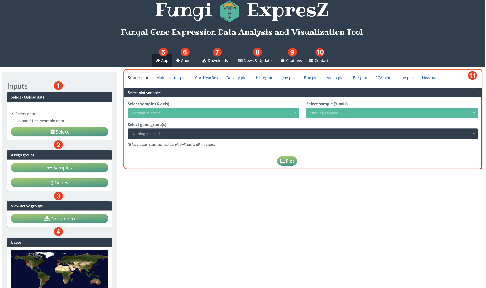

```{r, include = FALSE}
knitr::opts_chunk$set(
  collapse = TRUE,
  echo = FALSE, 
  fig.align="center", 
  fig.show="hold" , 
  comment = "#>"
)
```

<style>
body {
text-align: justify}
</style>
&nbsp;&nbsp;&nbsp;&nbsp;&nbsp;&nbsp;

# Introduction 

FungiExpresZ is a web based platform to analyze and visualize fungal gene expression data. It allows you to analyze and visualize ...

  1) NCBI SRA fungal gene expression data.
  2) User uploaded gene expression data. 
  3) NCBI SRA data combined with User uploaded data (1+2).    

It contains normalized  gene expression values of more than 12,000 NCBI SRA data from 8 different fungal species and, gene annotations and GO data of more than 100 different fungal species. For 3 strategies mentioned above, you can generate 12 different data exploratory plots and 6 different GO plots.
  
#### Data exploratory plots 

  1) Scatter plot 
  2) Multi-scatter plot
  3) CorrHeatBox
  4) Density plot
  5) Histogram
  6) Joy plot
  7) Box plot
  8) Violin plot
  9) Bar plot
  10) PCA plot
  11) Line plot 
  12) Heatmap 

#### GO plots

  1) EMAP plot
  2) CNET plot
  3) Dot plot 
  4) Bar plot 
  5) Heat box
  6) Upset plot
  
The purpose of this document is to explain all the key functionalities and methods used in this website wherever necessary. 


# Getting access 

There are three ways in which you can access FungiExpresZ. 

## Online 
  
  FungiExpresZ has been hoisted on shinyapps.io and can be accessed through the link https://cparsania.shinyapps.io/FungiExpresZ/. This is one of the quickest way to access the FungiExpresZ. However, due to limited computational resources, We recommend using this approach only when the size of the data is comparatively small (< 10 MB) and/or you are in a need of quick figure out of the data. Current setup allows approx. 30 concurrent users to access FungiExpresZ via link. Additional traffic may disconnect random users' session and you may end up loosing all analysis performed. Even without access traffic idle session timeout is 30 minutes, and therefore you may loose your analysis if you have thought to continue later. For stable, robust and to have long lasting session it is recommended to use one of the following two approaches.
  
  
## As an R package 
  
  
  FungiExpresZ can be installed as an R package on local computer or server. To do so you need basic skills of R programming language. 
  
  
### Prerequisites
  
   `R version (>= 3.6.1)`
   
### Install dependencies 

```
   install.packages("devtools")
   install.packages("BiocManager") 
   install.packages("data.table" , type = "binary") ## installing from source may cause error.  
```
  
### Set repositories (repos) 

``` 
options(repos = BiocManager::repositories())

```

### Install from package bundle
  

Download pre-compiled binary for MacOS ( FungiExpresZ<release_version>.tgz ) and source bundle for Windows ( FungiExpresZ<release_version>.tar.gz ) from [latest available release](https://github.com/cparsania/FungiExpresZ/releases/). Open an R terminal and use command below to install either on MacOS or Windows.  

``` 
devtools::install_local("path/to/.tgz file" , dependencies=TRUE,  build = FALSE, repos=BiocManager::repositories())

```
### Run
  
Once installation completes, it can be run using below command.
  
```
  library(FungiExpresZ);FungiExpresZ::run_app()
```

Copy and paste URL printed on the console to browser and you are ready to go 🎉🎉🎉🎉.
  

## Use as a docker container 

This approach is highly recommended because as a user you do not need to worry about any dependency related stuff.

### Install docker desktop

Follow the instructions given below to install docker desktop on ...

+ [Mac](https://docs.docker.com/docker-for-mac/install/)
+ [Windows](https://docs.docker.com/docker-for-windows/install/) 
+ [Linux](https://docs.docker.com/install/linux/docker-ce/ubuntu/)

### Pull FungiExpresZ docker image to a local computer

Once you installed the docker desktop, next step is to pull the FungiExpresZ's docker image. Before you pull the image make sure your docker desktop is running. Next, to pull the image, open the terminal and enter the below command. 

```
docker pull cparsania/fungiexpresz:<tagName>

```

Replace `<tagName>` with the version you want to download. For example, command below will download the version `0.0.1` 

```
docker pull cparsania/fungiexpresz:0.0.1
```

Possible values for `<tagName>` can be obtained from [here](https://hub.docker.com/r/cparsania/fungiexpresz/tags). We recommand you to pull latest available tag. 

### Run container 

After getting the image on local computer, it can be run as a container. The command below will open the port given as `<port_number>` on local computer and launch the application on same. 


```
docker run -p <port_number>:80 cparsania/fungiexpresz:<tagName>

```

You can give valid TCP `<port_number>` which is not occupied by your system (e.g. 3232, 3233, 5434, ... etc.).

Successful launch will print standard `R` welcome message on terminal with the final the line `http://0.0.0.0:80`. 


### Run on browser, Finally ..!!   

After launch, hitting one of these URLs `http://localhost:<port_number>` or `http://127.0.0.1:<port_number>` or `http://<your_ip_address>:<port_number>` should launch the application on your browser. 

Congrats!! 🎉🎉🎉🎉 .Your application will keep running until you  stop  container  explicitly.

### Memory usage for docker 

Depending upon size of the data you are analyzing, you may need to assign more computational resources to docker than the default which is 2 GB of memory and 4 CPUs on a mac with 32GB memory and 8 CPUs. Default behavior can be changed from `Docker -> Preferences -> Advanced`


We recommand users to allocate maximum 4 GB of memory to docker before you run FungiExpresZ docker image.  

### 2.2.6 How to stop container 

Container will be active until it is explicitly stopped. You can stop container using below command on a new terminal window. 

```
## get container id 
docker ps
docker stop <CONTAINER ID>
```


# Home screen 

Once the application loaded fully on a browser, it looks like as shown in the Fig-1. 


```{r , fig.cap="FIGURE 1: FungiExpresZ home screen",out.extra='style="background-color: black; padding:1px;"'}

```


 **1). Inputs** 
 
 It allows you to either upload or select data from pre-existing SRA data. Depending upon radio button selected (**Select data** or **Upload/Use example data**) submit button toggle between **Select** and **Upload**. Click either of these result in a popup which have been explained in Fig-2 and Fig-3.     
 
 **2). Assign groups**
 
 Often genomics and transcriptomics data contain sample groups i.e. replicates, strains, time points etc. and gene groups i.e. differentially expressed genes, genes specific to pathway etc. Comparison between them could reveal similarities and contrasts between these groups, which ultimately leads to unfold meaningful biological insights.  **Assign groups** feature allows you to upload user defined **Sample groups** and **Gene groups**. Additional info on file format to assign groups given in the Fig-4 and Fig-5.  Once the groups uploaded, you may color, cluster or facet the expression values in different plots according to groups assigned.
 
 **3). View active groups**
 
  By clicking on  **View active groups** one can check the current active groups (both sample and gene).  
 
 **4). Usage**
 
 It displays the locations across the globe, where FungiExpresZ has been used at least once. Blink sign is the indication of "at this moment" access from particular location.  Through the click on anywhere in the map you can get more insights on usage statistics across the globe. 
 
 **5). - 10). ** 
 
 Number 5-10 are different tabs i.e. **App**, **About**, **Downloads**, **News & Updates** ,**Citations**, **Contact**. Although one can anticipate content of each tab from the name, details on each has been given later in the tutorial. Current selected tab in Fig-1 is **App**. As you can see, it contains 12 different plot panels (default open is **Scatter plot**). Each plat panel is explained later in the tutorial.  
 
 
# Select/Upload data

Once you click on Select/Upload data (Fig-1 #2) relavent pop-up will appear. 

## Select SRA data

FungiExpresZ contains > 13,000 pre-processed NCBI SRA data from 8 different fungal species. The values given are normalized gene expressed values (FPKM / RPKM etc.) Some of these data have been obtained from public resources while remaining ones are processed by us. You can select any of these data for purpose of analysis and visualizations. Once you click on Select data button the pop-up will appear as shown in Fig-2. 

```{r , fig.cap="FIGURE 2: FungiExpresZ select SRA data", out.width="50%",out.extra='style="background-color: black; padding:1px;"' }
knitr::include_graphics(c("step_by_step_guide_files/screen_shots/02_fe_select_data.png"))

```

**1) Organism **

Dropdown **Organism** allows you to select organism of your choice. Once oranism selected table below will show data of selected organism only. 

**2) Strain and 3) Genotype**

Dropdown **Strain** and **Genotype** allows you to filter by stain and genotype respectively for selected Organism. Both of these filters works with AND operator and therefore, while applying them together will only work if both condition satisfy. P.S. Current settings doesn't allow selection of more than one value in each filter. 

**4) Reset Strain** and **5) Reset Genotype**

 #4 and #5 are reset options for dropdown **Strain** and dropdown **Genotype** respectively.  

**6) Select all rows**
 
 Once the data filtered (By organism, strain and genotype) you need to select the row(s) from resultant table to make them available for analysis and visualization. As name suggests click on **Select all rows** will select all the rows being displayed in the table. You may alos use `shift` key from the keyboard to select more than one rows simultaneously.

**7) Copy**

Click on **Copy** button copy data displayed in the table to your clipboard. You may paste them to any spreadsheet like program to better organize and understand.

**8) Download**

Using button **Download** you can even download data being displayed in the table to one of these three formats i.e. .csv, .pdf or excel. 

**9) Column visibility**

Click on **Column visibility** will lists the hidden columns to the table. You may select one or more of them to make them visible in the table being displayed. 

**10) Search**

Besides **Organism**, **Strain** and **Genotype** filters, you can perform free text filter from the text box given under **Search** title. Input text will be matched against all the column being displayed in the table and matching rows will be displayed as a result. 

**11) Clear all**

Click on **Clear all** will deselect rows if selected any. 

**12) Submit**

Once the rows selected hitting button **Submit** will make selected data available for analysis. For selected data, SRA id will be displayed as sample identity in each plot panel. 


## Upload user data

Often transcriptomics data found in tabular like format where columns are samples i.e. replicates, time-points, multiple strain types etc. and rows are genes. Each cell in a table contains normalized gene expression values. You can either upload such a tabular format data in .txt file format or paste in a text box to FungiExpresZ for the purpose of analysis and visualization. Once you click on the button **Upload** (Fig-1 #2), pop-up showed in the Fig-3 will appear. 

```{r , fig.cap="FIGURE 3: FungiExpresZ upload user data",out.extra='style="background-color: black; padding:1px;"' , out.width="50%"}
knitr::include_graphics(c("step_by_step_guide_files/screen_shots/03_fe_file_upload.png"))

```
 
**1) Upload example data** 

Upon selection of this check-box example data will be activated. 

**2) Upload data** 

This section allows you to upload your own data. As mentioned above you may either choose uploading tabular format data in .txt file or paste data in a given text box. In both cases column names and row names are necessary requirements. Later, while analyzing data column names will appear as a sample identity in each plot panel, while row names will be used in background to fetch organism's  annotations (gene start, gene end, gene strand,gene description, GO terms etc.). 

**3) Select column separator** 

Selection of correct column separator for the uploaded data is required to upload data successfully. Default is **tab**. You may also select **comma** or **semicolon**. 

**4) Select species**

Selection of a species is optional. However, correct species selection is required to perform gene annotations and GO analysis. Once  the species selected is done, in background FungiExpresZ matches row names of uploaded data to the database id of selected species. For the selected species, you can cross check your id with the database id from the example database id given below the species selection drop-down menu. 

**5) Log transformation**

Due to wide range of RPKM / FPKM / TPM values, often, they need to be log transformed before visualizing the data. Once the data uploaded, FungiExpresZ allows you to log transform  (log2 or log10) uploaded data. To avoid `NAs` from the log transformation of 0s, FungiExpresZ adds constant 1 to all the uploaded values. 

**6) Join data** 

FungiExpresZ allows you to perform combined analysis of uploaded data with pre-existing NCBI-SRA data. To use this functionality, you first need to select the pre-existing NCBI-SRA data of you interest from the FungiExpresZ. To know more about how to select SRA data refer the section **Select SRA data** (Fig-2). Next step is to upload your data, which you want to join with selected NCBI-SRA data. Once both these steps done, you can select **Join data** option to merge both of these data in background. For successful execution of join data operation row names of uploaded data must match to the database id of a selected species. 

**7) Submit** 

Click on **Submit** will lock all inputs made above and data will be available for the analysis and visualizations. 


# Assign groups


## Sample groups

// TO DO 

```{r , fig.cap="FIGURE 4: FungiExpresZ define sample groups" ,out.extra='style="background-color: black; padding:1px;"' , out.width="50%"}
knitr::include_graphics(c("step_by_step_guide_files/screen_shots/05_fe_sample_group.png"))

```


## Gene groups

// TO DO 

```{r , fig.cap="FIGURE 5: FungiExpresZ define gene groups",out.extra='style="background-color: black; padding:1px;"' , out.width="50%"}
knitr::include_graphics(c("step_by_step_guide_files/screen_shots/06_fe_gene_group.png"))

```

# View active groups

// TO DO 

# Plot panels

// TO DO 

## Plot input panels

// TO DO 

### Scatter plot 
```{r , fig.cap="FIGURE XXX: FungiExpresZ Scatter plot input panel" , out.width="100%"  }
knitr::include_graphics(c("step_by_step_guide_files/screen_shots/02_fe_scatter_plot_select_variables.png"))
```

// TO DO 

### Multi-scatter plot, CorrHeatBox, Density plot, Histogram, Joy plot, Box plot, Violin plot and PCA plot

// TO DO 

```{r , fig.cap="FIGURE XXX: FungiExpresZ Multi-scatter plot, CorrHeatBox, Density plot, Histogram, Joy plot, Box plot. Violin plot and PCA plot input panel" , out.width="100%"  }
knitr::include_graphics(c("step_by_step_guide_files/screen_shots/02_fe_multi_scatter_to_violin_variable_selection.png"))
```

### Bar plot inputs

// TO DO 
```{r , fig.cap="FIGURE XXX:FungiExpresZ Bar plot input panel" , out.width="100%"  }
knitr::include_graphics(c("step_by_step_guide_files/screen_shots/02_fe_barplot_inputs.png"))
```


### Line plot inputs

// TO DO 
```{r , fig.cap="FIGURE XXX: FungiExpresZ Line plot input panel" , out.width="100%"  }
knitr::include_graphics(c("step_by_step_guide_files/screen_shots/02_fe_lineplot_inputs.png"))
```


### Heatmap inputs

// TO DO 

```{r , fig.cap="FIGURE XXX: FungiExpresZ Heatmap inputs" , out.width="100%"  }
knitr::include_graphics(c("step_by_step_guide_files/screen_shots/02_heatmap_inputs.png"))
```

# Plot settings

// TO DO 
## Common plot settings

```{r , fig.cap="FIGURE XXX: FungiExpresZ common plot settings : `Theme and Legend` (left), `Labels & Title` (right)" , out.width="30%"  }
knitr::include_graphics(c("step_by_step_guide_files/screen_shots/10_common_theme_and_legend_settings.png",
                          "step_by_step_guide_files/screen_shots/11_common_labels_and_title.png"))
```

## Plot specific settings 

### Scatter plot 

// TO DO 

```{r , fig.cap="FIGURE XXX: FungiExpresZ Scatter plot advance options" , out.width="30%"  }
knitr::include_graphics(c("step_by_step_guide_files/screen_shots/09_scatter_plot_advance_settings.png"))
```


### Multi-scatter plot

// TO DO 

```{r , fig.cap="FIGURE XXX: FungiExpresZ Multi-scatter plot advance options" , out.width="30%"  }
knitr::include_graphics(c("step_by_step_guide_files/screen_shots/12_multi_scatter_plot_advance_settings.png"))
```

### CorrHeatBox   

// TO DO 

```{r , fig.cap="FIGURE XXX: FungiExpresZ Corr heat-box advance options" , out.width="30%"  }
knitr::include_graphics(c("step_by_step_guide_files/screen_shots/13_corr_heat_box_advance_settings.png"))
```

### Density plot

// TO DO

```{r , fig.cap="FIGURE XXX: FungiExpresZ Density plot advance options" , out.width="30%"  }
knitr::include_graphics(c("step_by_step_guide_files/screen_shots/14_density_plot_advance_settings.png"))
```
### Histogram

// TO DO 
```{r , fig.cap="FIGURE XXX: FungiExpresZ  Histogram advance options" , out.width="30%"  }
knitr::include_graphics(c("step_by_step_guide_files/screen_shots/15_histogram_advance_settings.png"))
```
### Joy plot

// TO DO 
```{r , fig.cap="FIGURE XXX: FungiExpresZ Joy plot advance options" , out.width="30%"  }
knitr::include_graphics(c("step_by_step_guide_files/screen_shots/16_joy_plot_advance_settings.png"))
```
### Box plot

// TO DO 

```{r , fig.cap="FIGURE XXX: FungiExpresZ Box plot advance options" , out.width="30%"  }
knitr::include_graphics(c("step_by_step_guide_files/screen_shots/17_boxplot_advance_settings.png"))
```

### Violin plot

// TO DO 

```{r , fig.cap="FIGURE XXX: FungiExpresZ Violin plot advance options" , out.width="30%"  }
knitr::include_graphics(c("step_by_step_guide_files/screen_shots/18_violin_plot_advance_settings.png"))
```

### Bar plot

// TO DO 
```{r , fig.cap="FIGURE XXX: FungiExpresZ Bar plot advance options" , out.width="30%"  }
knitr::include_graphics(c("step_by_step_guide_files/screen_shots/19_barplot_advance_settings.png"))
```

### PCA plot

// TO DO 
```{r , fig.cap="FIGURE XXX: FungiExpresZ PCA plot advance options" , out.width="30%"  }
knitr::include_graphics(c("step_by_step_guide_files/screen_shots/20_pca_plot_advance_settings.png"))
```

### Line plot

// TO DO 
```{r , fig.cap="FIGURE XXX: FungiExpresZ  Line plot advance options" , out.width="30%"  }
knitr::include_graphics(c("step_by_step_guide_files/screen_shots/21_line_plot_advance_settings.png"))
```

### Heatmap

// TO DO 

```{r , fig.cap="FIGURE XXX: FungiExpresZ Heatmap row options (left), column options (middle) and legend options(right)." , out.width="30%"  }

```

# GO analysis and visualizations 

// TO DO 

```{r , fig.cap="FIGURE XXX: FungiExpresZ GO analysis inputs" , out.width="100%"  }
knitr::include_graphics(c("step_by_step_guide_files/screen_shots/27_go_inputs.png"))
```

# GO plots specific settings 

// TO DO 

### Dot plot and Bar plot 

// TO DO 
```{r , fig.cap="FIGURE XXX: FungiExpresZ GO Dot plot and Bar plot advance options" , out.width="30%"  }
knitr::include_graphics(c("step_by_step_guide_files/screen_shots/29_dot_and_bar_plot_advance_settings.png"))
```

### EMAP plot

// TO DO 

```{r , fig.cap="FIGURE XXX: FungiExpresZ GO EMAP plot advance options" , out.width="30%"  }
knitr::include_graphics(c("step_by_step_guide_files/screen_shots/28_emap_plot_advance_settings.png"))
```

### CNET plot

// TO DO 
```{r , fig.cap="FIGURE XXX: FungiExpresZ GO CNET plot advance options" , out.width="30%"  }
knitr::include_graphics(c("step_by_step_guide_files/screen_shots/30_cnet_plot_advance_Settings.png"))
```


### UPSET plot

// TO DO 
```{r , fig.cap="FIGURE XXX: FungiExpresZ GO Upset plot advance options" , out.width="30%"  }
knitr::include_graphics(c("step_by_step_guide_files/screen_shots/31_upset_plot_advance_settings.png"))
```

### Heat plot
  
// TO DO 
```{r , fig.cap="FIGURE XXX: FungiExpresZ GO Heat plot advance options" , out.width="30%"  }
knitr::include_graphics(c("step_by_step_guide_files/screen_shots/33_go_heat_plot_advance_settings.png"))
```


# Other panels

// TO DO 

## About 

// TO DO 

```{r , fig.cap="FIGURE XXX: FungiExpresZ `Overview` page" , out.width="90%" ,out.extra='style="background-color: black; padding:1px;"' }
knitr::include_graphics(c("step_by_step_guide_files/screen_shots/38_fe_overview.png"))
```

``` {r, fig.cap="FIGURE XXX: FungiExpresZ `Tutorial` page" , out.width="90%", out.extra='style="background-color: black; padding:1px;"' }
knitr::include_graphics(c("step_by_step_guide_files/screen_shots/39_fe_tutorials.png"))
```


## Downloads 

// TO DO 

``` {r, fig.cap="FIGURE XXX: FungiExpresZ `Downloads --> Gene expression data` page" , out.width="90%", out.extra='style="background-color: black; padding:1px;"' }
knitr::include_graphics(c("step_by_step_guide_files/screen_shots/35_fe_gene_expression_downloads.png"))
```

``` {r, fig.cap="FIGURE XXX: FungiExpresZ `Download --> GO data` page" , out.width="90%", out.extra='style="background-color: black; padding:1px;"' }
knitr::include_graphics(c("step_by_step_guide_files/screen_shots/35_fe_gene_expression_downloads.png"))
```

## News & Updates

// TO DO 

``` {r, fig.cap="FIGURE XXX: FungiExpresZ `News & Updates` page" , out.width="90%", out.extra='style="background-color: black; padding:1px;"' }
knitr::include_graphics(c("step_by_step_guide_files/screen_shots/37_fe_news_and_updates.png"))
```


## Citations

// TO DO 
``` {r, fig.cap="FIGURE XXX: FungiExpresZ `Citations` page" , out.width="90%", out.extra='style="background-color: black; padding:1px;"' }
knitr::include_graphics(c("step_by_step_guide_files/screen_shots/34_fe_citations.png"))
```


